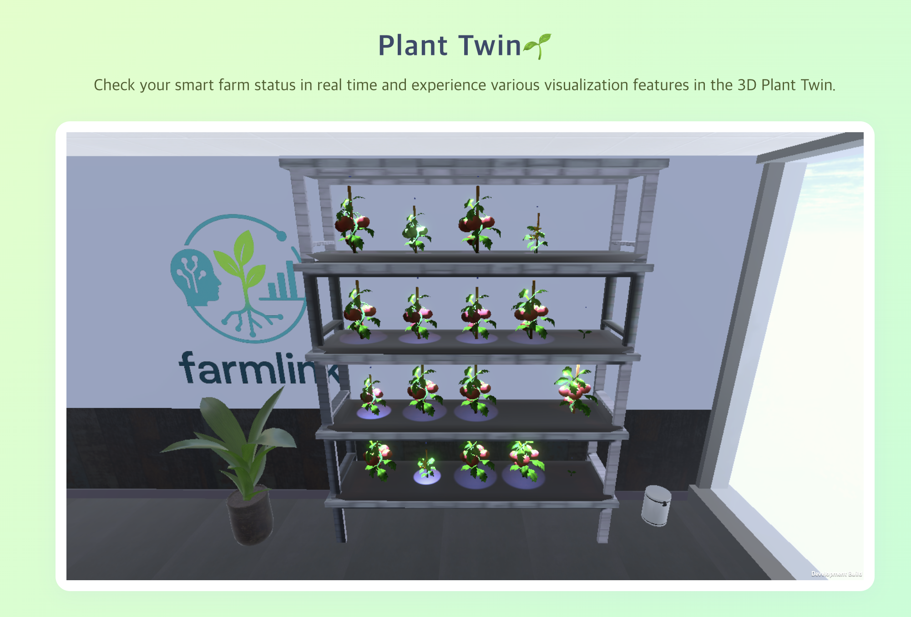

# Farm Link🌿
## AI 기반 생육 진단과 디지털 트윈을 활용한 스마트팜 품질관리 시스템

## 📚 프로잭트 소개
Our project is to create a smart farm that can monitor the growth environment in real time based on sensor data and improve crop productivity through automatic control

In addition, we would like to use ai to provide more differentiated services
It detects physiological inhibitions and diseases of plants through images and informs users of them so that crops can be easily managed
Based on environmental data, the growth of plants is predicted, and information on growth is visualized through digital twins to provide information to users
 
### 📅 개발 기간
- 25.07.18. - 25.08.25.

### 👨‍👩‍👧‍👦 맴버 구성
- 팀장 : 오연희
- 팀원 : 김찬빈, 손승우, 양지은, 유지찬, 이용훈

### 📌 업무 분담
- 오연희 : AI
- 유지찬 : AI
- 김찬빈 : 프론트엔드
- 손승우 : 백엔드, 배포, unity
- 양지은 : 센서
- 이용훈 : PM

## 📌 주요 기능

### 🧠 **AI 생육 진단**
- 작물 이미지 분석을 통한 병해 탐지
- 생리 장애 조기 인지 및 사용자 알림 기능

### 🌡️ **환경 데이터 기반 제어**
- 센서 데이터를 실시간 수집 (온도, 습도, 조도, 토양 등)
- 임계치 기반 자동 제어 로직 적용

### 📊 **생장 예측 모델**
- 시간에 따른 생육 데이터 학습
- 작물 성장 상태 및 수확 시기 예측

### 🪞 **Digital Twin 시각화**
- Unity 기반 가상 농장 구현

- 현재 생육 상태 및 환경 정보 시각화

### ⚙️ 기술 스텍

## Architecture

## ERD

