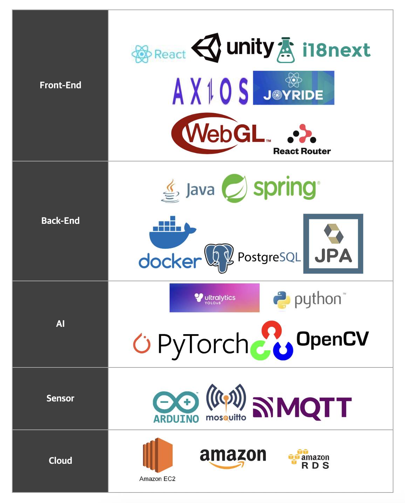

  
  <h1>🌿AI 기반 생육 진단과 디지털 트윈을 활용한 스마트팜 시스템🌿</h1>
  

## 프로잭트 소개 - 25.07.18. - 25.08.25.
**Farm Link**는 실시간 환경 모니터링 센서와 AI 기반 생육 진단을 결합한 스마트팜 품질관리 시스템입니다.  
생육 환경을 자동 제어하고 작물 생장 예측 및 디지털 트윈 시각화를 통해 사용자에게 직관적인 품질관리 기능을 제공합니다.

- 이미지 기반 AI 분석으로 **생리 장애 및 병해 탐지**
- 환경 데이터 기반 **생장 예측**
- **Digital Twin (React, Unity WebGL)** 시각화를 통한 사용자 인터랙션 제공

### 👨‍👩‍👧‍👦 맴버 구성
- 팀장 : 오연희
- 팀원 : 김찬빈, 손승우, 양지은, 유지찬, 이용훈

### 📌 업무 분담
- 오연희 : AI
- 유지찬 : AI
- 김찬빈 : 프론트엔드
- 손승우 : 백엔드, 배포, unity
- 양지은 : 센서
- 이용훈 : PM
### 📌 환경

  

***

## 📌 주요 기능

### 🧠 **AI 생육 진단**
- 작물 이미지 분석을 통한 병해 탐지
- 생리 장애 조기 인지 및 사용자 알림 기능

### 🌡️ **환경 데이터 기반 제어**
- 센서 데이터를 실시간 수집 (온도, 습도, 조도, 토양 등)
- 임계치 기반 자동 제어 로직 적용

### 📊 **생장 예측 모델**
- 시간에 따른 생육 데이터 학습
- 작물 성장 상태 및 수확 시기 예측

### 🪞 **Digital Twin 시각화**
- Unity 기반 가상 농장 구현
- 현재 생육 상태 및 환경 정보 시각화

## ⚙️ Architecture ⚙️

  

---
## 🧠 AI 🧠
### Yolo

  

### Time Series

  

## 🪞 Unity 🪞

  

## 🛠️ Backend 🛠️

### ERD

  

### UML Diagram

## 🖼️ Frontend 🖼️

### Pages

  
  
  

## 📡 Sensor 📡

  

## 📄 License

This project is licensed under the **MIT License** — see the [LICENSE](./LICENSE) file for details.
